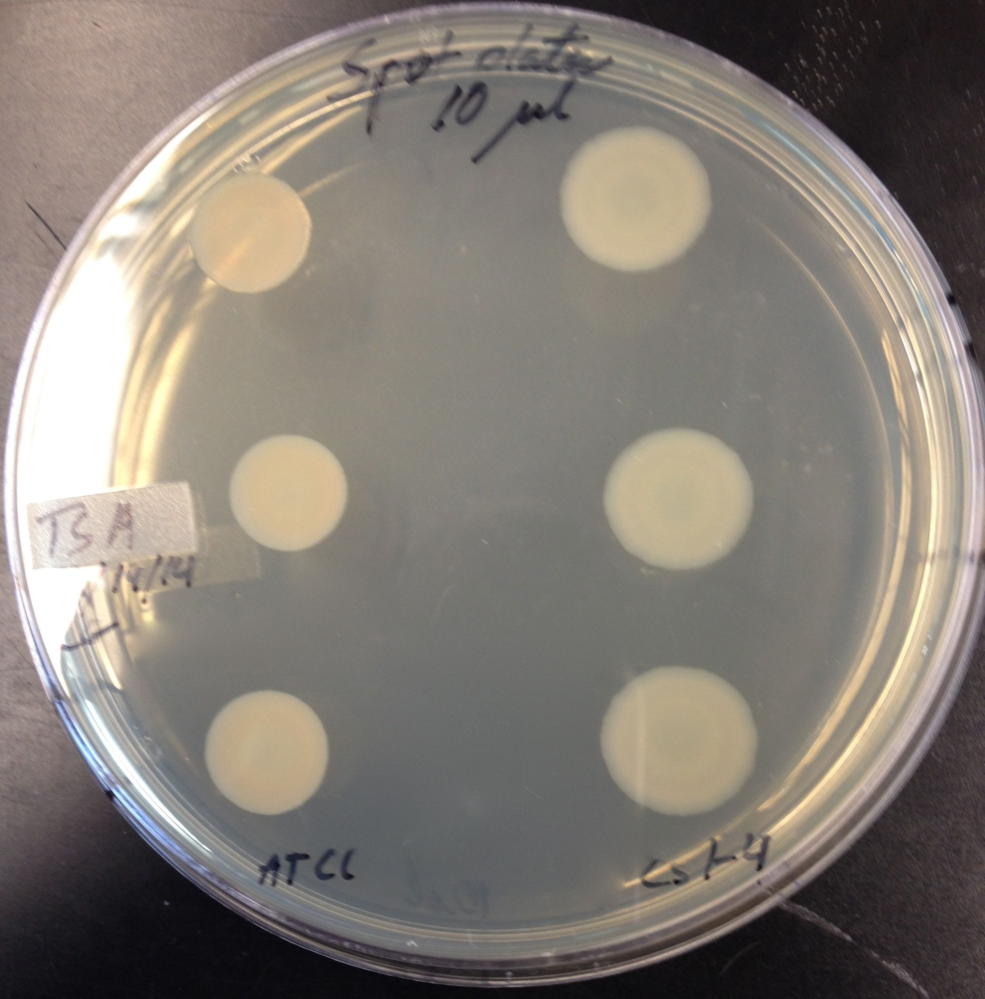
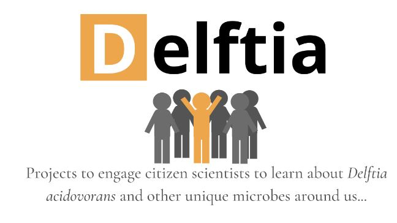

```{=html}
<section class="hero-section" style="padding:3.5rem 2rem 3rem;">
  <h1 style="font-size:clamp(1.8rem,4vw,2.6rem);">About The Delftia Project</h1>
  <p class="hero-subtitle" style="font-size:1.05rem;">
    A community of undergraduate researchers, citizen scientists, and educators
    dedicated to exploring one of microbiology's most extraordinary organisms.
  </p>
</section>
```

## Our Mission {#mission}

The Delftia Project is a collaborative research and education initiative based at **NC State University**, focused on *Delftia acidovorans*. We bring together undergraduate researchers, citizen scientists, and educators to explore the biology, applications, and broader impacts of this remarkable microorganism.

We believe that science is most powerful when it is **collaborative, transparent, and accessible** — to students, researchers, and the general public alike.

---

## What We Do {#what-we-do}

```{=html}
<div class="card-grid" style="margin-bottom:2rem;">
  <div class="feature-card">
    <div class="card-icon" aria-hidden="true">🔬</div>
    <h3>Research &amp; Discovery</h3>
    <p>
      Investigating the genomics, metabolism, and environmental roles of <em>Delftia</em>
      through wet-lab experiments, sequencing, and bioinformatics.
    </p>
  </div>
  <div class="feature-card">
    <div class="card-icon" aria-hidden="true">🎓</div>
    <h3>Undergraduate Education</h3>
    <p>
      Integrating <em>Delftia</em> research into course-based learning experiences
      — giving students authentic research opportunities early in their careers.
    </p>
  </div>
  <div class="feature-card">
    <div class="card-icon" aria-hidden="true">🌐</div>
    <h3>Citizen Science</h3>
    <p>
      Engaging the broader community in collaborative annotation and scientific
      discovery via platforms like Hypothes.is and WikiEDU.
    </p>
  </div>
  <div class="feature-card">
    <div class="card-icon" aria-hidden="true">♻️</div>
    <h3>Applied Biotechnology</h3>
    <p>
      Exploring <em>Delftia</em>'s potential in bioremediation, gold recovery from
      e-waste, and sustainable biotechnology applications.
    </p>
  </div>
</div>
```

---

## Research Spotlight {#research-spotlight}

::: {.research-spotlight}
::: {.research-spotlight-text}
### Undergraduate Research Experiences

Students in courses like **MB 360** and **LSC 170 (Microbial Superheroes)** at NC State
participate in genuine research experiences. They culture *Delftia* in the lab, perform
spot-plate assays, analyze published literature collaboratively, and contribute to our
growing understanding of this organism.

These course-based undergraduate research experiences (CUREs) give students the skills,
confidence, and connections to pursue scientific careers.

<a href="news.html" class="btn-hero btn-primary-hero" style="font-size:0.9rem;padding:0.55rem 1.4rem;">See Student Work →</a>
:::
{fig-alt="Spot plate showing Delftia bacterial growth" style="max-height:380px;width:100%;object-fit:cover;"}
:::

::: {.research-spotlight .reverse style="background:var(--delftia-light);"}
{fig-alt="DELFTIA citizen science community project" style="max-height:380px;width:100%;object-fit:cover;"}

::: {.research-spotlight-text}
### Citizen Science &amp; Community Annotation

Through our partnership with **WikiEDU** and **Hypothes.is**, community volunteers
contribute to annotating and improving scientific knowledge about *Delftia*. In 2020,
17 undergraduate volunteers enrolled in the Delftia WikiEDU program to improve
information equity about this organism on Wikipedia.

These projects bridge the gap between academic research and public knowledge.

<a href="news.html" class="btn-hero btn-primary-hero" style="font-size:0.9rem;padding:0.55rem 1.4rem;">Learn About Citizen Science →</a>
:::
:::

---

## Our Community {#community}

The Delftia Project thrives because of the contributions of many dedicated people:

```{=html}
<div class="team-grid">
  <div class="team-card">
    <div class="team-avatar">CG</div>
    <h4>Dr. Carlos Goller</h4>
    <div class="team-role">Principal Investigator · NC State</div>
  </div>
  <div class="team-card">
    <div class="team-avatar">LR</div>
    <h4>Lauren Ramilo</h4>
    <div class="team-role">Undergraduate Researcher</div>
  </div>
  <div class="team-card">
    <div class="team-avatar">DN</div>
    <h4>Daiza Norman</h4>
    <div class="team-role">BIT Research Assistant</div>
  </div>
  <div class="team-card">
    <div class="team-avatar">RT</div>
    <h4>Rabeya Tahir</h4>
    <div class="team-role">WikiEDU &amp; Graphics Lead</div>
  </div>
  <div class="team-card">
    <div class="team-avatar">+</div>
    <h4>You?</h4>
    <div class="team-role">Future Researcher</div>
  </div>
</div>
```

---

## Get Involved {#get-involved}

Whether you are a student, educator, or simply curious about microbiology,
there are multiple ways to contribute to the Delftia Project:

```{=html}
<div class="card-grid" style="margin-top:1.5rem;margin-bottom:2rem;">
  <div class="feature-card" style="border-left-color:var(--delftia-gold);">
    <div class="card-icon" aria-hidden="true">🧪</div>
    <h3>Undergraduate Researcher</h3>
    <p>
      Join our lab or enroll in a course-based research experience at NC State.
      Gain hands-on skills in microbiology, genomics, and bioinformatics.
    </p>
  </div>
  <div class="feature-card" style="border-left-color:var(--delftia-gold);">
    <div class="card-icon" aria-hidden="true">✏️</div>
    <h3>Citizen Scientist</h3>
    <p>
      Participate in our Hypothes.is annotation groups or WikiEDU programs.
      No lab required — just curiosity and a web browser.
    </p>
  </div>
  <div class="feature-card" style="border-left-color:var(--delftia-gold);">
    <div class="card-icon" aria-hidden="true">🤝</div>
    <h3>Collaborator</h3>
    <p>
      Are you a researcher, educator, or institution with shared interests?
      We welcome interdisciplinary collaborations in genomics, bioremediation,
      education, and beyond.
    </p>
  </div>
</div>
```

::: {style="text-align:center;padding:1rem 0 2rem;"}
For more information, visit [NC State University's website](https://www.ncsu.edu) or check out the [News](news.qmd) section for recent updates and opportunities.
:::
