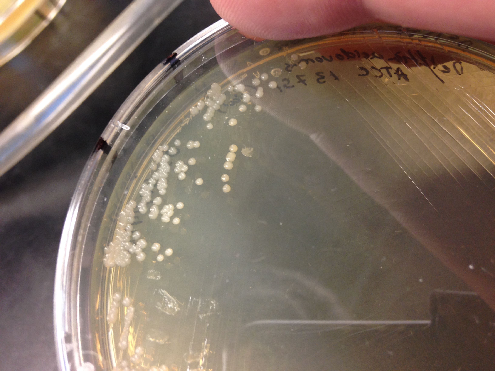
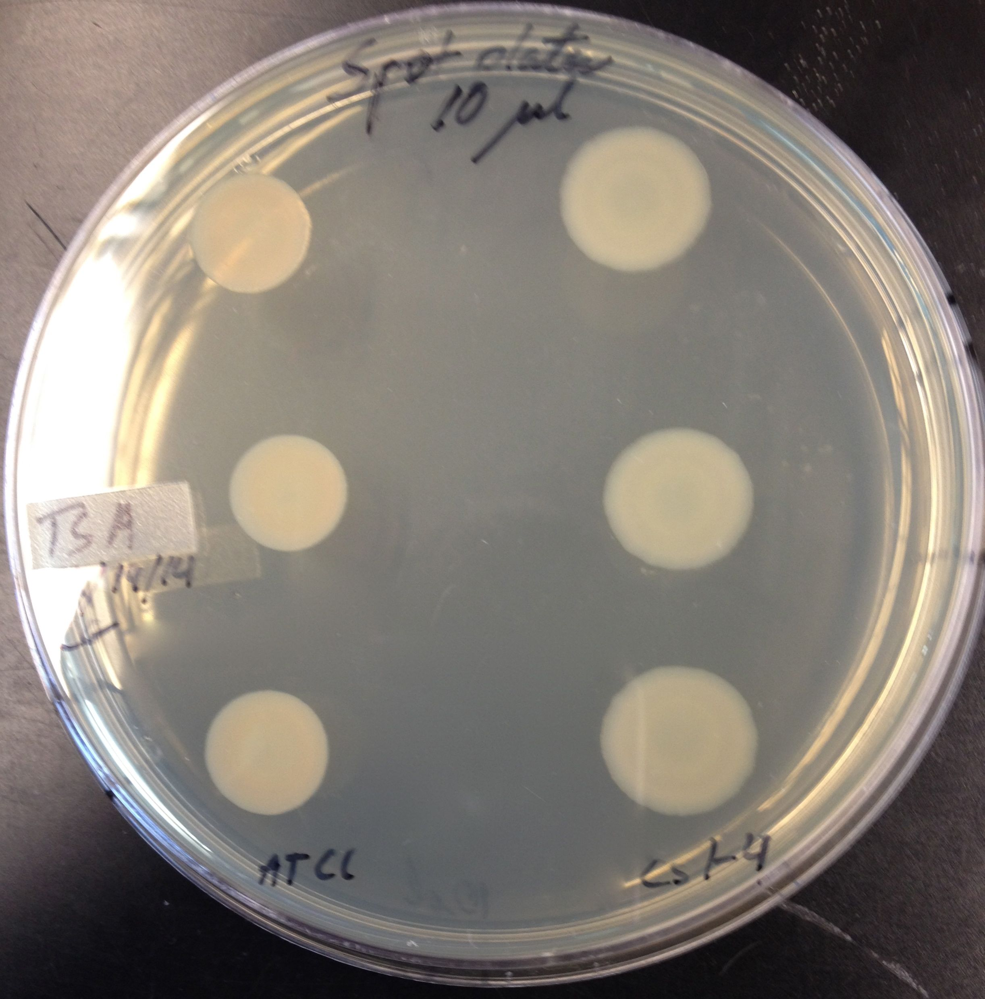
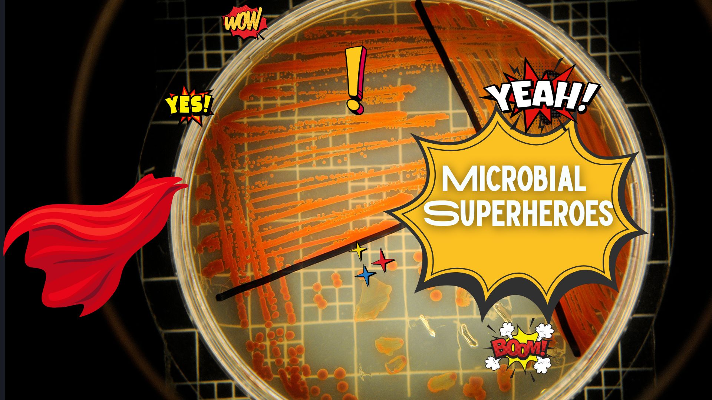
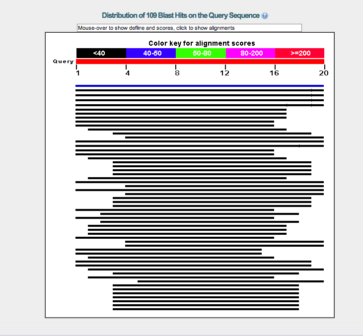
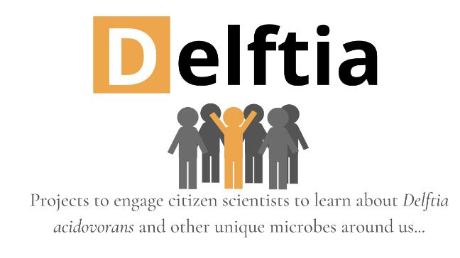

## What is *Delftia acidovorans*?

*Delftia acidovorans* is a gram-negative, non-fermentative bacterium found in soil and water [1,2]. It was first identified in Delft, Netherlands, in soil enriched with acetamide [3]. Recently, it has been found in other environments, such as waste-contaminated soil and drains [4].

This bacterium thrives in habitats containing high concentrations of heavy metals, such as copper and cobalt [5], and it produces a nonribosomal peptide that allows it to avoid toxicity from gold by precipitating it out of solution [6]. *D. acidovorans* is also considered an opportunistic agent and has been found in several reports of infection in immunocompromised patients [1,2].

{fig-alt="Microscopic image of Delftia acidovorans bacteria showing characteristic morphology"}

## Learn More About...

### Undergraduate Research

Research by undergraduate scholars, including course-based research experiences in Microbiology and Microbial Superheroes analysis. Students engage in hands-on research with *Delftia* and explore its applications in biotechnology.

{fig-alt="Laboratory spot plate showing Delftia bacterial growth in MB 360 course-based research"}

{fig-alt="LSC 170 Microbial Superheroes course analyzing Delftia-related publications"}

### Genomics and Automation

Learning about *Delftia* with automation and high-throughput sequencing technologies. These tools help us understand the genome and capabilities of this fascinating organism.

{fig-alt="BLAST sequence analysis results showing Delftia genetic data"}

### Citizen Science

Community projects and citizen science initiatives bringing *Delftia* research to a broader audience. Participate in collaborative annotation and discovery efforts with our community of researchers and learners.

{fig-alt="DELFTIA citizen science project graphic showing community research activities"}

---

For references and citations, see our [References](references.qmd) page. Check out the [News](news.qmd) section for updates on projects and research.
