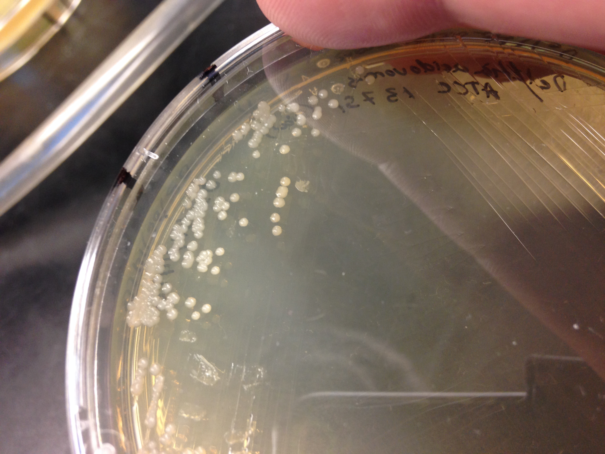
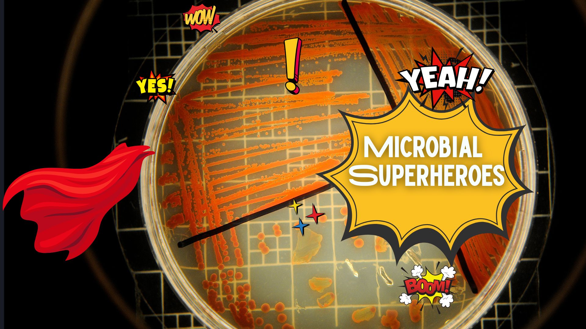
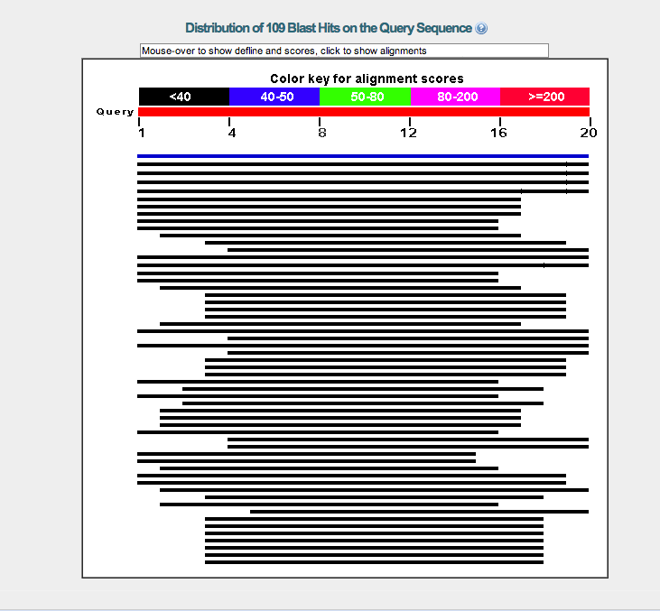

```{=html}
<!-- ===== HERO ===== -->
<section class="hero-section">
  <h1>The Delftia Project</h1>
  <p class="hero-subtitle">
    Unlocking the secrets of <em>Delftia acidovorans</em> — a remarkable bacterium
    that biomineralizes gold, thrives in toxic environments, and holds promise for
    bioremediation and biotechnology.
  </p>
  <div>
    <a href="about.html#get-involved" class="btn-hero btn-primary-hero">Get Involved</a>
    <a href="#research-highlights" class="btn-hero btn-outline-hero">Explore Research</a>
  </div>
</section>

<!-- ===== STATS BAR ===== -->
<section class="stats-bar">
  <div class="stats-grid">
    <div class="stat-item">
      <div class="stat-number">4</div>
      <div class="stat-label">Published References</div>
    </div>
    <div class="stat-item">
      <div class="stat-number">17+</div>
      <div class="stat-label">Student Researchers</div>
    </div>
    <div class="stat-item">
      <div class="stat-number">3</div>
      <div class="stat-label">Research Initiatives</div>
    </div>
    <div class="stat-item">
      <div class="stat-number">NC&nbsp;State</div>
      <div class="stat-label">University Partner</div>
    </div>
  </div>
</section>
```

## What is *Delftia acidovorans*? {#about-delftia}

::: {.research-spotlight}
::: {.research-spotlight-text}
*Delftia acidovorans* is a gram-negative, non-fermentative bacterium first identified in Delft, Netherlands, in soil enriched with acetamide. It thrives in habitats containing high concentrations of heavy metals — copper, cobalt, and even **gold** — and produces a nonribosomal peptide that allows it to precipitate gold out of solution, avoiding toxicity.

Today, *Delftia* is found in waste-contaminated soil, water systems, and drains. Beyond its remarkable environmental capabilities, it is studied as an opportunistic pathogen and explored for applications in:

<span class="tag-chip">🏅 Gold Biomineralization</span>
<span class="tag-chip">♻️ E-Waste Recycling</span>
<span class="tag-chip">🌿 Bioremediation</span>
<span class="tag-chip">🧬 Genomics</span>
<span class="tag-chip">🔬 Undergraduate Research</span>

<br/><br/>
<a href="references.html" class="btn-hero btn-primary-hero" style="font-size:0.9rem;padding:0.55rem 1.4rem;">Read the Literature →</a>
:::

{fig-alt="Colonies of Delftia acidovorans on agar" style="max-height:400px;width:100%;object-fit:cover;"}
:::

---

```{=html}
<!-- ===== RESEARCH HIGHLIGHTS ===== -->
<section id="research-highlights" class="section-alt" style="padding: 4rem 1.5rem;">
  <div style="max-width:1100px;margin:0 auto;text-align:center;">
    <h2 class="section-title">Research Highlights</h2>
    <p class="section-subtitle">Three pillars of the Delftia Project — from the classroom to the community</p>
    <div class="card-grid">

      <div class="feature-card">
        <div class="card-icon">🎓</div>
        <h3>Undergraduate Research</h3>
        <p>
          Students in MB 360 and LSC 170 engage in hands-on course-based research experiences —
          growing <em>Delftia</em> in the lab, analyzing spot plates, and dissecting
          "Microbial Superheroes" publications.
        </p>
      </div>

      <div class="feature-card">
        <div class="card-icon">🤖</div>
        <h3>Genomics &amp; Automation</h3>
        <p>
          High-throughput sequencing and automation tools help us decode the genome of
          <em>Delftia</em>. BLAST analyses, bioinformatics pipelines, and cloud computing
          accelerate discovery.
        </p>
      </div>

      <div class="feature-card">
        <div class="card-icon">🌐</div>
        <h3>Citizen Science</h3>
        <p>
          Community annotators collaborate via Hypothes.is to mine the scientific literature
          on <em>Delftia</em> as a pathogen, gold-biomineralizing agent, and e-waste recycler.
        </p>
      </div>

    </div>
  </div>
</section>
```

## Lab Gallery

::: {style="display:grid;grid-template-columns:repeat(auto-fit,minmax(220px,1fr));gap:1.2rem;margin-top:1.5rem;"}
::: {style="text-align:center;"}
{fig-alt="Laboratory spot plate with Delftia colonies" style="border-radius:12px;width:100%;object-fit:cover;height:180px;box-shadow:0 2px 10px rgba(0,0,0,0.1);"}

**Spot Plate — 48 hrs**  
*MB 360 course-based research*
:::

::: {style="text-align:center;"}
{fig-alt="LSC 170 students analyzing Delftia publications" style="border-radius:12px;width:100%;object-fit:cover;height:180px;box-shadow:0 2px 10px rgba(0,0,0,0.1);"}

**LSC 170 — Microbial Superheroes**  
*Publication analysis workshop*
:::

::: {style="text-align:center;"}
{fig-alt="BLAST results for Delftia reverse primer" style="border-radius:12px;width:100%;object-fit:cover;height:180px;box-shadow:0 2px 10px rgba(0,0,0,0.1);"}

**BLAST Analysis**  
*Reverse primer sequence search*
:::

::: {style="text-align:center;"}
{fig-alt="DELFTIA citizen science graphic" style="border-radius:12px;width:100%;object-fit:cover;height:180px;box-shadow:0 2px 10px rgba(0,0,0,0.1);"}

**Citizen Science**  
*Community annotation project*
:::
:::

---

```{=html}
<!-- ===== CALL TO ACTION ===== -->
<section class="cta-section">
  <h2>Interested in Joining the Delftia Project?</h2>
  <p>
    Whether you are an undergraduate student, educator, or citizen scientist —
    there is a place for you. Help us uncover the biology and applications of
    one of nature's most fascinating microbes.
  </p>
  <a href="about.html#get-involved" class="btn-hero btn-primary-hero">Get Involved Today</a>
  <a href="news.html" class="btn-hero btn-outline-hero">See Latest News</a>
</section>
```
