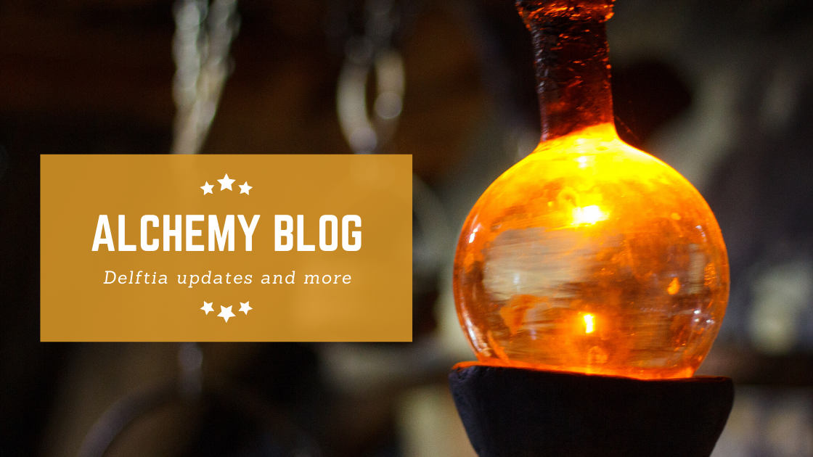
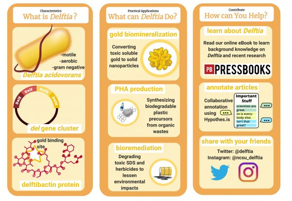

## Recent Updates from the Delftia Project

### The Delftia Project: Engaging Citizen Scientists
**January 16, 2021**

Authors: Lauren Ramilo, Daiza Norman, Rabeya Tahir, Tanasha Lertjanyarak, Carlos Goller

Presented at the 2021 Mid-Atlantic SENCER Conference. Learn about collaborative annotation practices and how citizen scientists can participate in meaningful research. Collaborative annotation enables groups to work together annotating electronic materials while making annotations visible to all participants.

---

### Meet the Researcher: Rabeya Tahir
**December 31, 2020**

Rabeya Tahir is a new addition to the Delftia team, helping with the WikiEdu course and producing graphics focused on bioremediation and electronic waste recycling. She is from Long Island, New York, and brings valuable expertise to our research efforts.

---

### Delftia WikiEDU
**December 1, 2020**

WikiEDU is a nonprofit organization that serves to incorporate Wikipedia into education. From August to November 2020, 17 undergraduate volunteers enrolled in the Delftia WikiEDU class. Our goal was to improve the accessibility of Delftia research, improving information equity and catalyzing future research. Students prepared for Wikipedia editing through virtual lessons and reference collection.

---

### Pathogen Case Study
**November 28, 2020**

Examining *Delftia* as a pathogen through collaborative annotation. Learn about the case studies we analyzed. Check out our Hypothes.is group for detailed annotations on Delftia-related literature.

---

### Literature Findings: Delftia as a Pathogen
**November 28, 2020**

Our community of annotators found important information on infections involving *Delftia acidovorans*. Join us on Hypothes.is to see the full annotations and findings.

*Disclaimer: This information should not be used as medical advice.*

---

### #CitSciChat Recap
**November 25, 2020**

Lauren Ramilo, one of our undergraduate researchers, hosted a #CitSciChat on Twitter. These events use a Q&A-style format to drive fast-paced conversations about citizen science. Lauren's chat explored a new corner of citizen science where participants do hands-on research about microbes and biotechnology.

---

### Meet the Researcher: Daiza Norman
**October 30, 2020**

Daiza Norman is a Biotechnology Research Assistant at the BIT program and a biological science major with a concentration in molecular, cellular, and developmental biology. She has worked on many Delftia-related projects with the BIT program, including the "Where's Delftia?" project.

---

### Annotation Focus: Delftia as a Pathogen
**October 27, 2020**

*Delftia* has attracted interest in biotechnology due to its ability to recover gold from solution, but it has also raised concerns in medicine. Although it is a rare opportunistic pathogen, it can be hard to identify and effectively treat. Join our annotations to explore the scientific literature on this topic.

---

### Delftia and E-Waste: Literature Findings
**October 7, 2020**

Our community of annotators took on an interesting challenge: exploring how Delftia and its ability to biomineralize gold could be applied to recover gold from e-waste. Discover what our volunteer annotators found about improving e-waste recycling.

---

### Presenting Delftia at the Sidewalk Symposium
**October 1, 2020**

Members of our research team had the opportunity to present current research at the Sidewalk Symposium. Thanks to the Office of Undergraduate Research, NC State Libraries, and the Crafts Center for sponsoring this event! Students created visual representations of their research.

---

### Live Annotation: E-Waste
**September 16, 2020**

Join us for live annotation sessions where we delve deeper into Delftia topics and foster our community of annotators. Meet peers, practice reading scientific literature, and learn about e-waste and bioremediation.

---

---
title: "News & Updates"
---

## Recent Updates from the Delftia Project

### The Delftia Project: Engaging Citizen Scientists
**January 16, 2021**

Authors: Lauren Ramilo, Daiza Norman, Rabeya Tahir, Tanasha Lertjanyarak, Carlos Goller

Presented at the 2021 Mid-Atlantic SENCER Conference. Learn about collaborative annotation practices and how citizen scientists can participate in meaningful research. Collaborative annotation enables groups to work together annotating electronic materials while making annotations visible to all participants.

---

### Meet the Researcher: Rabeya Tahir
**December 31, 2020**

Rabeya Tahir is a new addition to the Delftia team, helping with the WikiEdu course and producing graphics focused on bioremediation and electronic waste recycling. She is from Long Island, New York, and brings valuable expertise to our research efforts.

---

### Delftia WikiEDU
**December 1, 2020**

WikiEDU is a nonprofit organization that serves to incorporate Wikipedia into education. From August to November 2020, 17 undergraduate volunteers enrolled in the Delftia WikiEDU class. Our goal was to improve the accessibility of Delftia research, improving information equity and catalyzing future research. Students prepared for Wikipedia editing through virtual lessons and reference collection.

---

### Pathogen Case Study
**November 28, 2020**

Examining *Delftia* as a pathogen through collaborative annotation. Learn about the case studies we analyzed. Check out our Hypothes.is group for detailed annotations on Delftia-related literature.

---

### Literature Findings: Delftia as a Pathogen
**November 28, 2020**

Our community of annotators found important information on infections involving *Delftia acidovorans*. Join us on Hypothes.is to see the full annotations and findings.

*Disclaimer: This information should not be used as medical advice.*

---

### #CitSciChat Recap
**November 25, 2020**

Lauren Ramilo, one of our undergraduate researchers, hosted a #CitSciChat on Twitter. These events use a Q&A-style format to drive fast-paced conversations about citizen science. Lauren's chat explored a new corner of citizen science where participants do hands-on research about microbes and biotechnology.

---

### Meet the Researcher: Daiza Norman
**October 30, 2020**

Daiza Norman is a Biotechnology Research Assistant at the BIT program and a biological science major with a concentration in molecular, cellular, and developmental biology. She has worked on many Delftia-related projects with the BIT program, including the "Where's Delftia?" project.

---

### Annotation Focus: Delftia as a Pathogen
**October 27, 2020**

*Delftia* has attracted interest in biotechnology due to its ability to recover gold from solution, but it has also raised concerns in medicine. Although it is a rare opportunistic pathogen, it can be hard to identify and effectively treat. Join our annotations to explore the scientific literature on this topic.

---

### Delftia and E-Waste: Literature Findings
**October 7, 2020**

Our community of annotators took on an interesting challenge: exploring how Delftia and its ability to biomineralize gold could be applied to recover gold from e-waste. Discover what our volunteer annotators found about improving e-waste recycling.

---

### Presenting Delftia at the Sidewalk Symposium
**October 1, 2020**

Members of our research team had the opportunity to present current research at the Sidewalk Symposium. Thanks to the Office of Undergraduate Research, NC State Libraries, and the Crafts Center for sponsoring this event! Students created visual representations of their research.

---

### Live Annotation: E-Waste
**September 16, 2020**

Join us for live annotation sessions where we delve deeper into Delftia topics and foster our community of annotators. Meet peers, practice reading scientific literature, and learn about e-waste and bioremediation.

---

### Annotation Focus: Recovering E-Waste
**September 1, 2020**

Every year up to 50 million tons of electronics are discarded, with only 12% properly recycled. Current recycling methods are costly and energy-intensive. Explore how *Delftia* may play a role in improving e-waste recycling and recovery.

