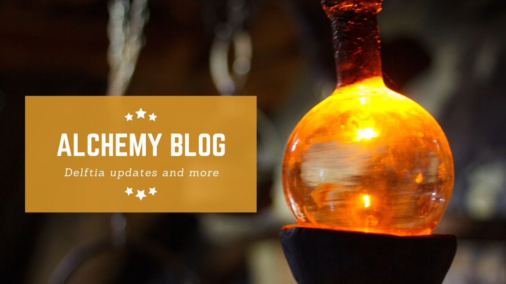
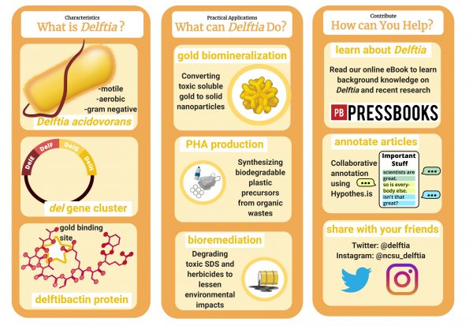

```{=html}
<section class="hero-section" style="padding:3.5rem 2rem 3rem;">
  <h1 style="font-size:clamp(1.8rem,4vw,2.6rem);">News &amp; Updates</h1>
  <p class="hero-subtitle" style="font-size:1.05rem;">
    Stay up to date with the latest projects, student research, and community events from the Delftia Project.
  </p>
</section>
```

<div style="max-width:900px;margin:0 auto;padding:3rem 1.5rem;">

<div class="timeline">

<div class="timeline-item">
<div class="timeline-date">January 16, 2021</div>
<div class="timeline-card">
<h3>The Delftia Project: Engaging Citizen Scientists</h3>
<p>
<em>Authors: Lauren Ramilo, Daiza Norman, Rabeya Tahir, Tanasha Lertjanyarak, Carlos Goller</em><br/><br/>
Presented at the 2021 Mid-Atlantic SENCER Conference. This presentation explored collaborative annotation practices and how citizen scientists can participate in meaningful research. Collaborative annotation enables groups to annotate electronic materials together while making those annotations visible to all participants.
</p>
<p style="margin-top:0.8rem;">
<span class="tag-chip">Conference</span>
<span class="tag-chip">Citizen Science</span>
</p>
</div>
</div>

<div class="timeline-item">
<div class="timeline-date">December 31, 2020</div>
<div class="timeline-card">
<h3>Meet the Researcher: Rabeya Tahir</h3>
<p>
Rabeya Tahir is a new addition to the Delftia team, helping with the WikiEdu course and producing graphics focused on bioremediation and electronic waste recycling. She is from Long Island, New York, and brings valuable expertise to our research efforts.
</p>
<p style="margin-top:0.8rem;">
<span class="tag-chip">Team Spotlight</span>
<span class="tag-chip">WikiEDU</span>
</p>
</div>
</div>

<div class="timeline-item">
<div class="timeline-date">December 1, 2020</div>
<div class="timeline-card">
<h3>Delftia WikiEDU</h3>
<p>
WikiEDU is a nonprofit organization that incorporates Wikipedia into education. From August to November 2020, 17 undergraduate volunteers enrolled in the Delftia WikiEDU class. Our goal was to improve the accessibility of Delftia research, improving information equity and catalyzing future research. Students prepared for Wikipedia editing through virtual lessons and reference collection.
</p>
<p style="margin-top:0.8rem;">
<span class="tag-chip">Education</span>
<span class="tag-chip">Wikipedia</span>
<span class="tag-chip">Undergrad Research</span>
</p>
</div>
</div>

<div class="timeline-item">
<div class="timeline-date">November 28, 2020</div>
<div class="timeline-card">
<h3>Pathogen Case Study</h3>
<p>
Examining <em>Delftia</em> as a pathogen through collaborative annotation. Our team analyzed key case studies about <em>Delftia acidovorans</em> infections. Check out our Hypothes.is group for detailed annotations on Delftia-related literature.
</p>
<p style="margin-top:0.8rem;">
<span class="tag-chip">Pathogen Research</span>
<span class="tag-chip">Hypothes.is</span>
</p>
</div>
</div>

<div class="timeline-item">
<div class="timeline-date">November 28, 2020</div>
<div class="timeline-card">
<h3>Literature Findings: Delftia as a Pathogen</h3>
<p>
Our community of annotators found important information on infections involving <em>Delftia acidovorans</em>. Join us on Hypothes.is to see the full annotations and findings.<br/><br/>
<em>Disclaimer: This information should not be used as medical advice.</em>
</p>
<p style="margin-top:0.8rem;">
<span class="tag-chip">Literature Review</span>
<span class="tag-chip">Citizen Science</span>
</p>
</div>
</div>

<div class="timeline-item">
<div class="timeline-date">November 25, 2020</div>
<div class="timeline-card">
<h3>#CitSciChat Recap</h3>
<p>
Lauren Ramilo, one of our undergraduate researchers, hosted a #CitSciChat on Twitter. These events use a Q&amp;A-style format to drive fast-paced conversations about citizen science. Lauren's chat explored a new corner of citizen science where participants do hands-on research about microbes and biotechnology.
</p>
<p style="margin-top:0.8rem;">
<span class="tag-chip">Social Media</span>
<span class="tag-chip">Citizen Science</span>
</p>
</div>
</div>

<div class="timeline-item">
<div class="timeline-date">October 30, 2020</div>
<div class="timeline-card">
<h3>Meet the Researcher: Daiza Norman</h3>
<p>
Daiza Norman is a Biotechnology Research Assistant at the BIT program and a biological science major with a concentration in molecular, cellular, and developmental biology. She has worked on many Delftia-related projects with the BIT program, including the "Where's Delftia?" project.
</p>
<p style="margin-top:0.8rem;">
<span class="tag-chip">Team Spotlight</span>
<span class="tag-chip">BIT Program</span>
</p>
</div>
</div>

<div class="timeline-item">
<div class="timeline-date">October 27, 2020</div>
<div class="timeline-card">
<h3>Annotation Focus: Delftia as a Pathogen</h3>
<p>
<em>Delftia</em> has attracted interest in biotechnology due to its ability to recover gold from solution, but it has also raised concerns in medicine. Although it is a rare opportunistic pathogen, it can be hard to identify and effectively treat. Join our annotations to explore the scientific literature on this topic.
</p>
<p style="margin-top:0.8rem;">
<span class="tag-chip">Annotation</span>
<span class="tag-chip">Medicine</span>
</p>
</div>
</div>

<div class="timeline-item">
<div class="timeline-date">October 7, 2020</div>
<div class="timeline-card">
<h3>Delftia and E-Waste: Literature Findings</h3>
<p>
Our community of annotators took on an interesting challenge: exploring how <em>Delftia</em> and its ability to biomineralize gold could be applied to recover gold from e-waste. Discover what our volunteer annotators found about improving e-waste recycling.
</p>
<p style="margin-top:0.8rem;">
<span class="tag-chip">E-Waste</span>
<span class="tag-chip">Bioremediation</span>
<span class="tag-chip">Gold Recovery</span>
</p>
</div>
</div>

<div class="timeline-item">
<div class="timeline-date">October 1, 2020</div>
<div class="timeline-card">
<h3>Presenting Delftia at the Sidewalk Symposium</h3>
<p>
Members of our research team had the opportunity to present current research at the Sidewalk Symposium. Thanks to the Office of Undergraduate Research, NC State Libraries, and the Crafts Center for sponsoring this event! Students created visual representations of their research.
</p>
<p style="margin-top:0.8rem;">
<span class="tag-chip">Outreach</span>
<span class="tag-chip">Student Presentations</span>
</p>
</div>
</div>

<div class="timeline-item">
<div class="timeline-date">September 16, 2020</div>
<div class="timeline-card">
<h3>Live Annotation: E-Waste</h3>
<p>
Join us for live annotation sessions where we delve deeper into Delftia topics and foster our community of annotators. Meet peers, practice reading scientific literature, and learn about e-waste and bioremediation.
</p>
<p style="margin-top:0.8rem;">
<span class="tag-chip">Live Event</span>
<span class="tag-chip">E-Waste</span>
</p>
</div>
</div>

<div class="timeline-item">
<div class="timeline-date">September 1, 2020</div>
<div class="timeline-card">
<h3>Annotation Focus: Recovering E-Waste</h3>
<p>
Every year up to 50 million tons of electronics are discarded, with only 12% properly recycled. Current recycling methods are costly and energy-intensive. Explore how <em>Delftia</em> may play a role in improving e-waste recycling and recovery.
</p>
<div style="display:grid;grid-template-columns:repeat(auto-fit,minmax(200px,1fr));gap:1rem;margin-top:1rem;">


</div>
<p style="margin-top:0.8rem;">
<span class="tag-chip">E-Waste</span>
<span class="tag-chip">Sustainability</span>
<span class="tag-chip">Gold Recovery</span>
</p>
</div>
</div>

</div><!-- .timeline -->
</div>

```{=html}
<section class="cta-section">
  <h2>Stay Connected</h2>
  <p>
    Follow our progress, participate in annotations, or join a research experience.
    The Delftia Project welcomes newcomers at every level.
  </p>
  <a href="about.html#get-involved" class="btn-hero btn-primary-hero">Get Involved</a>
</section>
```
